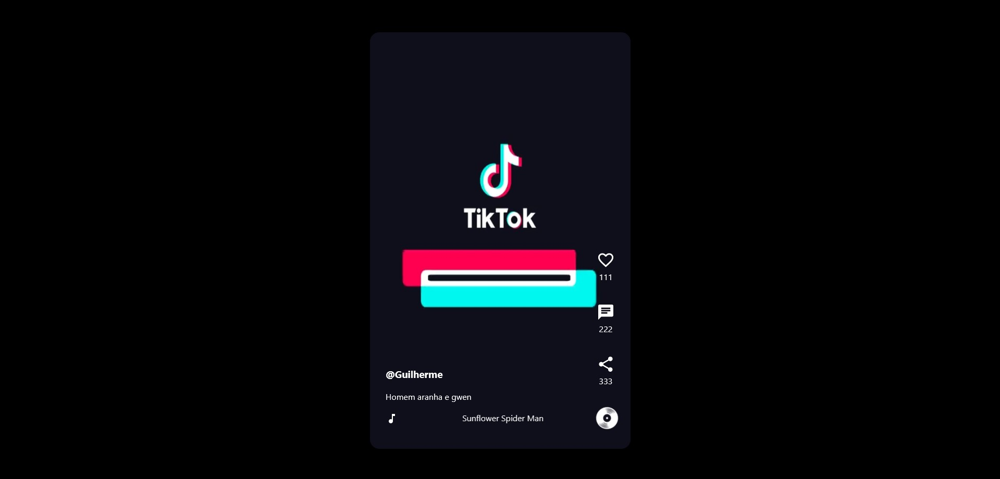

<h1 align="center"> Tiktok Clone </h1>

 
Programa exclusivo  e gratuito, promovido pela Rocketseat para ensino de tecnologias Web.

  <a href="#-tecnologias">Tecnologias</a>&nbsp;&nbsp;&nbsp; | &nbsp;&nbsp;&nbsp;
  <a href="#memo-licença">Licença</a>

  

## 🔋 Tecnologias

Esse projeto foi desenvolvido com as seguintes tecnologias:

-React
-Github
-Firebase

## 💻 Projeto

Um clone do Tiktok, com videos linkados do firebase, e com a possibilidade de dar like nos videos.

## :memo: Licença

Esse projeto está sob a Licença MIT.

--

Feito com ♥ by Guilherme Moura
